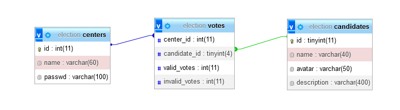
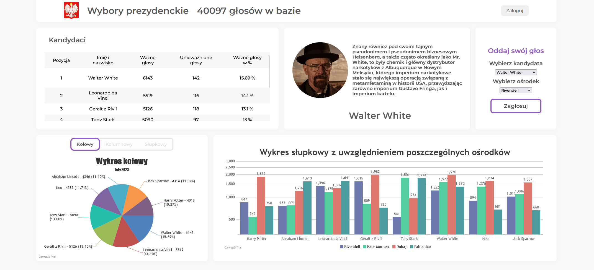

# Presidential Elections Voting System

This project is a web application built with PHP and MySQL for managing and displaying presidential election results. It provides a platform for voters to cast their votes and administrators to monitor and report election data. The project was carried out as a condition for passing a subject at a technical secondary school, therefore can be quite outdated. 

## Features

- **Candidate Management:** Display of candidates with their respective votes and percentages.
- **Data Visualization:** Graphical representation of voting data using pie charts and bar graphs for clear analysis.
- **User Authentication:** Secure user authentication system ensures only authorized users can access voting functionalities.
- **Multi-Station Voting:** Ability to cast votes from multiple polling stations, facilitating widespread participation.
- **Candidate Details:** Comprehensive profiles for each candidate, including background information and campaign platforms.

## Technologies Used

- **Backend:** PHP
- **Database:** MySQL
- **Frontend:** HTML, CSS, JavaScript

## Database Schema

## Screenshots

## License
*Note: The images included in this project are for demonstration purposes and are not owned by the project owner.*

